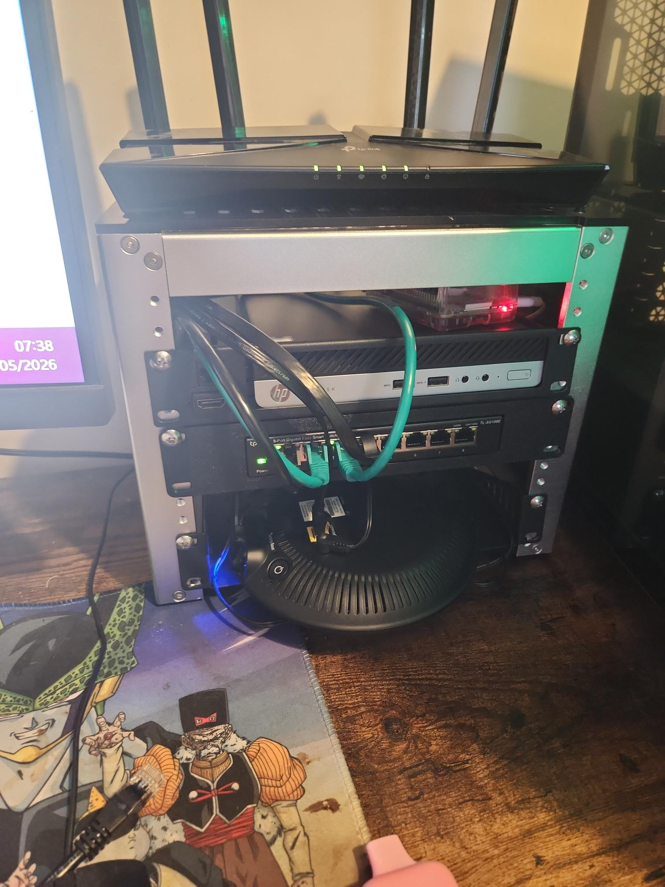

# Project 15 — Wutang Mini Rack Build

## Overview

Built a compact homelab rack to centralise networking, DNS, media services, and future virtualization workloads.

---

## Rack Photo

---

## Hardware

| Device | Role |
|---------|------|
| TP-Link Archer AX53 | WutangLAN Router |
| Raspberry Pi 4 | Pi-hole + Unbound |
| TP-Link 8-Port Switch | Core Switching |
| Jellyfin Server | Media Server |
| HP Mini PC | Future Proxmox Host |

---

## Port Mapping

| Port | Device |
|------|------|
| 1 | Pi-hole |
| 2 | HP Mini (Future Proxmox) |
| 3 | WutangLAN Router |
| 4 | Jellyfin Server |

---

## Validation Tests Completed

✅ Pi-hole working

✅ Jellyfin migrated to Ethernet

✅ SSH into Pi via Tailscale hostname

✅ Mobile external access verified on Samsung S22

✅ DNS resolution tested

✅ WiFi disabled on Jellyfin host

---

## Lessons Learned

The WiFi extender required a direct Ethernet path from the WutangLAN router rather than traversing the rack switch.

Future lab environments will be migrated to Proxmox to avoid previous Hyper-V external switching issues.

---

## Next Steps

- Correct PSU for HP Mini
- Install Proxmox
- Create Proxmox documentation
- Rebuild MSP Lab using isolated networking
